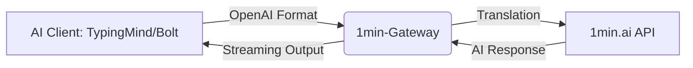

# 1min-Gateway 🚀

### *By BillelAttafi*

**The ultimate bridge to relay 1min.ai API into an OpenAI-compatible structure in seconds.**

Don't forget to **star** ⭐ this repository if you like it!

*Hosted version & details:* [kokodev.cc/1minrelay](https://www.kokodev.cc/1minrelay)

---

## ✨ Features

* **⚡ bolt.diy Support**: Fully compatible for seamless AI-assisted development.
* **🔗 OpenAI Standard**: Works with `TypingMind`, `ChatBox`, `LibreChat`, and more.
* **🧠 Multimodal Power**:
* **Vision**: Real-time image analysis.
* **Documents**: Support for `.pdf`, `.docx`, `.txt`, `.yaml`.
* **Generation**: Direct access to Flux, SDXL, and other 1min.ai models.

* **🚀 Performance & Security**:
* **Native Streaming**: Zero-latency real-time interactions.
* **Rate Limiting**: Built-in Memcached support for high-traffic stability.
* **Precision Tokenization**: Uses `Tiktoken` & `Mistral-Tokenizer`.

* **🌍 Cross-Platform**: Native builds for **ARM64** and **AMD64**.

---

## 🏗 Architecture



---

## 🛠 Installation

### 🐳 The Pro Way (Docker Compose)

Recommended for stability and auto-updates.

```bash
git clone https://github.com/billelattafi/1min-gateway.git
cd 1min-gateway

# 1. Setup your environment
cp .env.example .env
nano .env # Add your 1min.ai API Key

# 2. Launch (using Makefile)
make docker-up

```

### 📦 Simple Docker Run

```bash
docker run -d --name 1min-gateway \
  -p 5001:5001 \
  -e ONE_MIN_AI_API_KEY=your_key_here \
  billelattafi/1min-gateway:latest

```

---

## ⚙️ Configuration (.env)

| Variable | Description | Default |
| --- | --- | --- |
| `ONE_MIN_AI_API_KEY` | **Required** Your 1min.ai secret key. | `None` |
| `PERMIT_MODELS_FROM_SUBSET_ONLY` | Restrict usage to specific models. | `False` |
| `SUBSET_OF_ONE_MIN_PERMITTED_MODELS` | Allowed models (e.g., `gpt-4o,deepseek-chat`). | `Full Catalog` |
| `RATELIMIT_ENABLED` | Enable/Disable request throttling. | `True` |

---

## 💎 Support & Paid Perks

Support the project by [donating here](https://donate.stripe.com/00w4gB1NbdI60afcKPgMw00) or purchasing the [Hosted Version](https://shop.kokodev.cc/products).

* **Turnkey Hosting**: No server setup required.
* **Beta Access**: Get Audio/Video features before anyone else.
* **Priority Support**: Direct assistance on our **[Discord](https://discord.gg/GQd3DrxXyj)**.

---

## 🤝 Contributing

We love contributions! Please read our **[CONTRIBUTING.md](https://www.google.com/search?q=./CONTRIBUTING.md)** to learn about our development workflow and **Gitmoji** commit standards.

---

## 📜 License

Distributed under the **MIT License**.

**Copyright (c) 2026 Billel Attafi**
