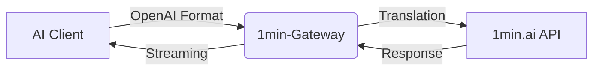

# 1min-Gateway 🚀

[](https://github.com/BillelAttafi/1min-gateway/actions)
[](https://hub.docker.com/r/billelattafi/1min-gateway)
[](https://opensource.org/licenses/MIT)
[](https://github.com/semantic-release/semantic-release)

**The ultimate bridge to relay 1min.ai API into an OpenAI-compatible structure.**

> Seamlessly integrate 1min.ai with any OpenAI-compatible client like TypingMind, bolt.diy, ChatBox, or LibreChat.

⭐ **Star this repository** if you find it useful!

🌐 **Hosted version**: [kokodev.cc/1minrelay](https://www.kokodev.cc/1minrelay)

---

## ✨ Features

| Category | Features |
|----------|----------|
| **🔗 Compatibility** | OpenAI-standard API • Works with TypingMind, ChatBox, LibreChat, bolt.diy |
| **🧠 Multimodal** | Vision (image analysis) • Documents (.pdf, .docx, .txt, .yaml) • Image generation (Flux, SDXL) |
| **🚀 Performance** | Native streaming • Rate limiting (Memcached) • Precision tokenization (Tiktoken, Mistral) |
| **🔒 Security** | Cosign-signed images • SBOM generation • Trivy vulnerability scanning |
| **🌍 Platform** | Multi-arch builds (AMD64 + ARM64) • Docker-ready • Auto-updates via Watchtower |

---

## 🏗 Architecture


```mermaid
graph LR
    A[AI Client] -->|OpenAI Format| B(1min-Gateway)
    B -->|Translation| C[1min.ai API]
    C -->|Response| B
    B -->|Streaming| A
```

---

## 🚀 Quick Start

### Automated Server Deployment (Recommended)

One command on a fresh server:

```bash
curl -fsSL https://raw.githubusercontent.com/billelattafi/1min-gateway/main/deploy.sh | bash
```

Handles Docker installation, interactive `.env` setup, pulls the image from Docker Hub, and verifies health.

### Docker Compose

```bash
# Clone the repository
git clone https://github.com/billelattafi/1min-gateway.git
cd 1min-gateway

# Configure environment
cp .env.example .env
nano .env  # Add your 1min.ai API Key

# Launch
make up
```

### Docker Run (minimal)

```bash
docker run -d --name 1min-gateway \
  --restart unless-stopped \
  -p 5001:5001 \
  --env-file .env \
  billelattafi/1min-gateway:latest
```

### Local Development

```bash
# Install dependencies
make install

# Run tests
make test

# Start development server
make dev
```

---

## ⚙️ Configuration

### Environment Variables

| Variable | Description | Default |
|----------|-------------|---------|
| `ONE_MIN_AI_API_KEY` | **Required** - Your 1min.ai API key | - |
| `PERMIT_MODELS_FROM_SUBSET_ONLY` | Restrict to specific models | `False` |
| `SUBSET_OF_ONE_MIN_PERMITTED_MODELS` | Allowed models list | All |
| `RATELIMIT_ENABLED` | Enable request throttling | `True` |
| `LOG_LEVEL` | Logging verbosity | `INFO` |
| `DEBUG` | Debug mode | `False` |

See [`.env.example`](.env.example) for complete configuration options.

---

## 📖 Documentation

| Document | Description |
|----------|-------------|
| [Contributing Guide](docs/CONTRIBUTING.md) | Development workflow and commit standards |
| [CI/CD Documentation](docs/CI-CD-DOCUMENTATION.md) | Pipeline architecture and configuration |
| [CI/CD Cheatsheet](docs/CI-CD-CHEATSHEET.md) | Quick reference for releases |
| [Dependabot Guide](docs/DEPENDABOT-DOCUMENTATION.md) | Automated dependency updates |
| [Docker & Environment](docs/ENV-DOCKER-GUIDE.md) | Container configuration |
| [API Parameters](docs/API_PARAMETERS.md) | Supported API parameters |

---

## 🛠 Development

### Prerequisites

- Python 3.12+
- Docker & Docker Compose
- Node.js 18+ (for commit hooks)

### Makefile Commands

```bash
make install      # Install dependencies and hooks
make dev          # Start development server
make test         # Run tests with coverage
make lint         # Check code quality (Ruff)
make format       # Format code (Ruff)
make up           # Docker Compose up
make down         # Docker Compose down
make clean        # Clean build artifacts
```

### Commit Convention

We use **Gitmoji + Conventional Commits**:

```bash
:sparkles: feat(Core): add new feature
:bug: fix(Gateway): resolve streaming issue
:memo: docs(Config): update configuration guide
```

See [gitmoji.dev](https://gitmoji.dev) for emoji codes.

---

## 💎 Support

Support the project:
- [GitHub Sponsors](https://github.com/sponsors/BillelAttafi)
- [Ko-fi](https://ko-fi.com/billelattafi)
- [Buy Me a Coffee](https://buymeacoffee.com/billel)

### Hosted Version Benefits

- Turnkey hosting (no server setup)
- Beta access to new features
- Priority support on [Discord](https://discord.gg/GQd3DrxXyj)

---

## 🤝 Contributing

Contributions are welcome! Please read our [Contributing Guide](docs/CONTRIBUTING.md) for details on:

- Development setup
- Commit message format
- Pull request process

---

## 📜 License

MIT License - Copyright (c) 2026 Billel Attafi

See [LICENSE](LICENSE) for details.
