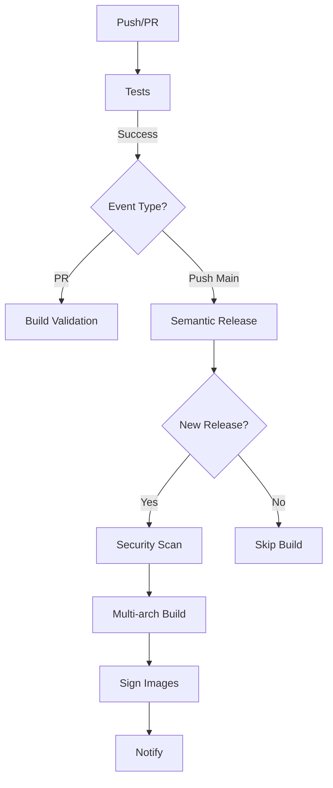

# 🚀 CI/CD Documentation - 1min-Gateway

Production-ready CI/CD pipeline with automated testing, security scanning, and multi-architecture builds.

## 📋 Table of Contents

- [Overview](#overview)
- [Architecture](#architecture)
- [Configuration](#configuration)
- [Triggering Releases](#triggering-releases)
- [Security](#security)
- [Troubleshooting](#troubleshooting)

---

## 🎯 Overview

This CI/CD workflow integrates industry best practices:

| Feature | Description |
|---------|-------------|
| ✅ Automated Testing | pytest with coverage reporting |
| ✅ Security Scanning | Trivy scans BEFORE publishing |
| ✅ Multi-arch Builds | AMD64 + ARM64 support |
| ✅ Image Signing | Cosign cryptographic signatures |
| ✅ SBOM Generation | Software Bill of Materials |
| ✅ PR Validation | Build validation without publishing |
| ✅ Semantic Versioning | Automatic version management |

---

## 🏗 Architecture


```mermaid
graph TD
    A[Push/PR] --> B[Tests]
    B -->|Success| C{Event Type?}
    C -->|PR| D[Build Validation]
    C -->|Push Main| E[Semantic Release]
    E --> F{New Release?}
    F -->|Yes| G[Security Scan]
    F -->|No| H[Skip Build]
    G --> I[Multi-arch Build]
    I --> K[Sign Images]
    K --> L[Notify]
```

---

## ⚙️ Configuration

### Required Secrets

Configure in **Settings → Secrets → Actions**:

| Secret | Description | Required |
|--------|-------------|----------|
| `DOCKER_USERNAME` | Docker Hub username | Yes |
| `DOCKER_PASSWORD` | Docker Hub access token | Yes |
| `SLACK_WEBHOOK_URL` | Slack notifications | No |

### Required Files

```
repository/
├── .github/
│   ├── workflows/
│   │   └── ci-cd.yml
│   └── dependabot.yml
├── .releaserc.json
├── Dockerfile
├── requirements.txt
└── pyproject.toml
```

### Semantic Release Configuration

`.releaserc.json`:

```json
{
  "branches": ["main"],
  "plugins": [
    ["@semantic-release/commit-analyzer", {
      "preset": "conventionalcommits",
      "releaseRules": [
        {"type": "feat",     "release": "minor"},
        {"type": "fix",      "release": "patch"},
        {"type": "perf",     "release": "patch"},
        {"type": "refactor", "release": "patch"},
        {"type": "docs",     "release": false},
        {"type": "chore",    "release": false}
      ]
    }],
    ["@semantic-release/release-notes-generator", {"preset": "conventionalcommits"}],
    ["@semantic-release/changelog", {"changelogFile": "CHANGELOG.md"}],
    ["@semantic-release/github"],
    ["@semantic-release/git", {"assets": ["CHANGELOG.md"]}]
  ]
}
```

> Note: The parser supports gitmoji prefixes in commit messages (e.g. `:sparkles: feat(Core): ...`) — the emoji is stripped and the conventional commit type is used for versioning.

---

## 🎬 Triggering Releases

### Commit Types and Version Bumps

| Gitmoji | Type | Release | Example |
|---------|------|---------|---------|
| `:sparkles:` | feat | Minor | `:sparkles: feat(Core): add feature` |
| `:bug:` | fix | Patch | `:bug: fix(Gateway): resolve issue` |
| `:zap:` | perf | Patch | `:zap: perf(Core): optimize query` |
| `:boom:` | breaking | Major | `:boom: feat(API): breaking change` |
| `:memo:` | docs | None | `:memo: docs: update README` |
| `:recycle:` | refactor | Patch | `:recycle: refactor(Core): cleanup` |

### Workflow Scenarios

**Pull Request:**
1. ✅ Tests run
2. ✅ Build validation (no push)
3. ⏭️ No release

**Push to main (no release type):**
1. ✅ Tests run
2. ⏭️ No version change detected
3. ⏭️ No build

**Push to main (feature/fix):**
1. ✅ Tests run
2. ✅ Semantic Release creates version
3. ✅ Security scan
4. ✅ Multi-arch build
5. ✅ Push to Docker Hub + GHCR
6. ✅ Sign images

---

## 🛡️ Security

### Supply Chain Security

- **Cosign**: Cryptographic image signatures
- **SBOM**: Dependency inventory
- **Provenance**: Build traceability

### Verify Image Signature

```bash
cosign verify \
  --certificate-identity-regexp=".*" \
  --certificate-oidc-issuer=https://token.actions.githubusercontent.com \
  billelattafi/1min-gateway:latest
```

### Vulnerability Scanning

Trivy and Grype scans run **before** publishing:
- ⚠️ Advisory-only — scan results are reported but do not block the build (to avoid cross-DB false positives)
- 📊 Results uploaded to GitHub Security tab

View results: **Repository → Security → Code scanning alerts**

### Minimal Permissions

```yaml
test:
  # Read-only (default)

release:
  permissions:
    contents: write  # Create tags/releases

build-and-push:
  permissions:
    packages: write       # Push to GHCR
    security-events: write # Upload Trivy results
```

---

## 🐛 Troubleshooting

### Build Fails: "No space left on device"

Add cleanup step:
```yaml
- name: Clean Docker space
  run: docker system prune -af --volumes
```

### Reviewing Vulnerability Scan Results

Scans are advisory-only and do not block the build. To review findings:

1. Check **Security → Code scanning** for details
2. Update base image in Dockerfile if needed:
   ```dockerfile
   FROM python:3.12-slim
   ```

### No Release Created

Check:
1. Commit message follows gitmoji format
2. `.releaserc.json` exists and is valid
3. Commit type triggers release (feat, fix, perf)

### Cosign Signing Fails

Verify:
- `COSIGN_EXPERIMENTAL=1` is set
- `id-token: write` permission is present

---

## 📊 Performance Metrics

| Job | First Run | With Cache |
|-----|-----------|------------|
| Tests | ~45s | ~20s |
| Release | ~30s | ~30s |
| Build & Push | ~8min | ~3min |
| **Total** | ~10min | ~4min |

### GitHub Actions Usage

- Free tier: 2,000 minutes/month
- Per release: ~4 minutes
- Capacity: ~500 releases/month

---

## 🏷️ Docker Image Tags

For release `v1.2.3`:

| Tag | Example |
|-----|---------|
| `latest` | `billelattafi/1min-gateway:latest` |
| Semver | `billelattafi/1min-gateway:1.2.3` |
| Minor | `billelattafi/1min-gateway:1.2` |
| Major | `billelattafi/1min-gateway:1` |
| SHA | `billelattafi/1min-gateway:main-a3f9c21` |

---

## 📚 Resources

- [Semantic Release](https://semantic-release.gitbook.io/)
- [Gitmoji](https://gitmoji.dev/)
- [Docker Buildx](https://docs.docker.com/buildx/)
- [Cosign](https://docs.sigstore.dev/cosign/)
- [Trivy](https://aquasecurity.github.io/trivy/)
